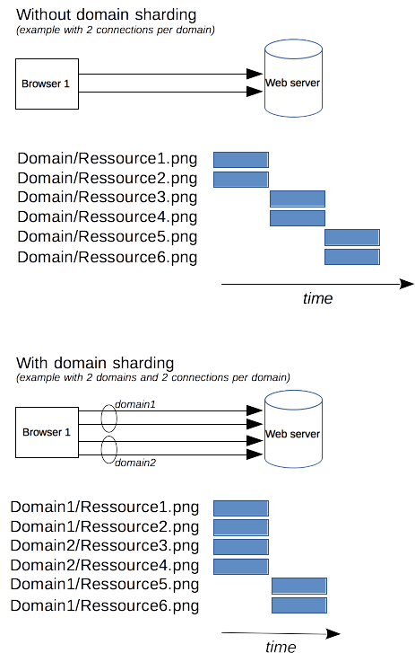

# HTTP 指南

## 1. HTTP 消息

HTTP 消息是服务器和客户端之间交换数据的方式。有两种类型的消息：请求（request）——由客户端发送用来触发一个服务器上的动作；响应（response）——来自服务器的应答。

起始行和 HTTP 消息中的 HTTP 头统称为请求头，而其有效负载被称为消息主体。

### 1.1 请求

请求由三个部分组成：起始行、请求头和消息主体。

（1）起始行

HTTP 请求是由客户端发出的消息，用来使服务器执行动作。

起始行（start-line）包含三个元素：

- 一个 HTTP 方法，它定义了客户端想要执行的动作。
- 请求的目标 URL。
- HTTP 版本。

（2）标头

基本结构：不区分大小写的字符串，紧跟着的冒号（':'）和一个结构取决于标头的值。整个标头（包括值）由一行组成，这一行可以相当长。

（3）主体

请求的最后一部分是它的主体。不是所有的请求都有一个主体：例如获取资源的请求，像 GET、HEAD、DELETE 和 OPTIONS，通常它们不需要主体。有些请求将数据发送到服务器以便更新数据：常见的的情况是 POST 请求（包含 HTML 表单数据）。

### 1.2 响应

响应由三个部分组成：起始行、响应头和消息主体。

（1）起始行

响应的第一行是 HTTP 版本、状态码和状态文本。如：`HTTP 版本：HTTP/1.0、HTTP/1.1、HTTP/2.0`。

（2）响应头

结构：不区分大小写的字符串，紧跟着的冒号（':'）和一个结构取决于标头类型的值。整个标头（包括其值）表现为单行形式。

（3）主体

响应的最后一部分是它的主体。响应的主体包含响应数据，它可以是 HTML、图片、JSON 文档等。

## 2. HTTP 会话

在像 HTTP 这样的客户端——服务器（Client-Server）协议中，会话分为三个阶段：

1. 客户端建立一条 TCP 连接（如果传输层不是 TCP，也可以是其他适合的连接）。
2. 客户端发送请求并等待应答。
3. 服务器处理请求并送回应答，回应包括一个状态码和对应的数据。

从 HTTP/1.1 开始，连接在完成第三阶段后不再关闭，客户端可以再次发起新的请求。这意味着第二步和第三步可以连续进行数次。

## 3. HTTP/1.x 的连接管理

### 3.1. 域名分片

作为 HTTP/1.x 的连接，请求是序列化的，并发连接数是 6 条。如果尝试大于这个数字，就有触发服务器 DoS 保护的风险。

不要在同一个域名下获取所有资源，假设有个域名是 `www.example.com`，我们可以把它拆分成好几个域名：`www1.example.com`、`www2.example.com`、`www3.example.com`。所有这些域名都指向同一台服务器，浏览器会同时为每个域名建立 6 条连接（在我们这个例子中，连接数会达到 18 条）。这一技术被称作域名分片。

